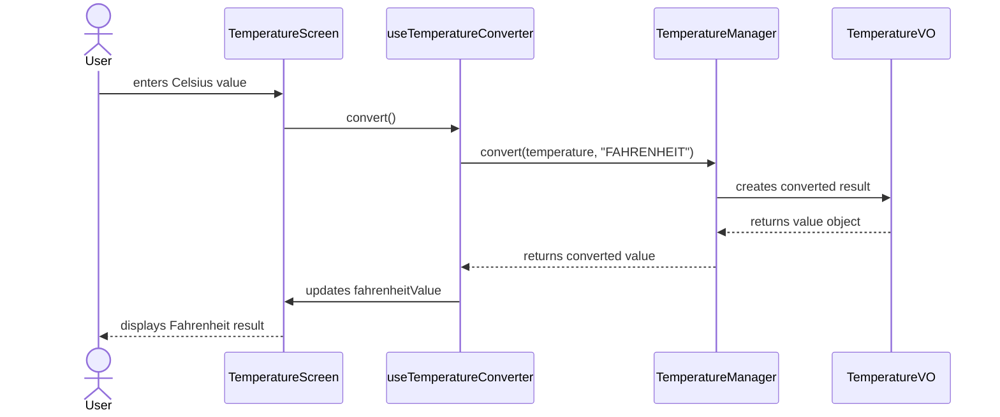

# Temperature Converter

This project was created with Expo using the following command:

```bash
npx create-expo-app@latest temperature-converter --template blank
```

The app uses a blank Expo template, which provides a minimal React Native project structure ready to run and customize.

This application is an example for the students of the course "# Integración de seguridad informática en redes y sistemas de software".

## What is React Native?

React Native is a framework for building mobile applications using JavaScript and React. It lets you create native-like apps for iOS and Android from a single codebase.

## What is Expo?

Expo is a set of tools and services built on top of React Native that makes mobile app development faster and easier. It provides a managed workflow, prebuilt libraries, and a simple way to run and test apps on devices and simulators.

## What is React Native Paper?

React Native Paper is a UI library for React Native that provides ready-to-use components such as buttons, text inputs, and typography following Material Design. It helps build a more polished and consistent mobile interface without having to create every visual element from scratch.

## Libraries added to the project

The following libraries were added to improve the UI and app structure:

- React Native Paper: added to provide Material Design components for the temperature screen.
- React Native Safe Area Context: added to handle safe areas on devices with notches or rounded corners.

They were installed with the following commands:

```bash
npm install react-native-paper
npm install react-native-safe-area-context
```

## Styling in React Native Paper

React Native Paper components can be styled using the `style` prop, just like other React Native components. In this project, styles were added through a `StyleSheet` definition to keep the layout organized and easier to maintain.

For example, components such as `Text`, `TextInput`, and `Button` can receive visual properties like `backgroundColor`, `color`, `padding`, `margin`, and `borderRadius` through the `style` prop or through a shared style object.

This approach was used to define the title, the input fields, and the button appearance in the temperature screen.

## Test Driven Development (TDD)

TDD is a development approach where tests are written first, then the implementation is added to make those tests pass. This helps define the expected behavior clearly before changing the code.

For this project, any new feature or change should follow TDD: first add or update the relevant test case, run the tests to confirm the failure, then implement the smallest change needed to make the test pass.

## MVC pattern in this example

MVC stands for Model-View-Controller. It is a software design pattern that separates an application into three main parts:

- Model: contains the business logic and the data structures. In this app, the temperature rules are handled in the model layer through the manager and the value object.
- View: is the part that the user sees and interacts with. In this project, the screen component renders the UI and displays the input and result fields.
- Controller: manages the flow between the view and the model. In this example, the custom hook acts as the controller by receiving the user input, invoking the conversion logic, and updating the screen state.

This structure helps keep the code organized, easier to understand, and simpler to maintain.

### UML sequence diagram of the application flow



This diagram uses Mermaid syntax to represent the interaction between the user, the screen, the controller logic, and the model layer in a UML-style sequence flow.

## Run the tests

To execute the test suite, run:

```bash
npm test
```

Jest was installed as a development dependency to support the test suite for this project.

## Environment used

The project was created with the following tool versions:

- Node.js: v24.19.0
- npm: 11.17.0
- Expo SDK: ~54.0.35
- React Native: 0.81.5

Expo SDK 54 was used because it is the version currently configured in the project dependencies and is compatible with the modern Expo/React Native stack used by this app.

## Run the application

Install dependencies:

```bash
npm install
```

Start the Expo development server:

```bash
npm start
```

This will open the Expo developer tools in your browser and provide a QR code for testing on a device.

## Run on Android Studio emulator

1. Open Android Studio.
2. Start an Android emulator.
3. In the terminal, run:

```bash
npm run android
```

Expo will connect to the running emulator and launch the app.

## Run on Xcode simulator

1. Open Xcode.
2. Start an iOS simulator.
3. In the terminal, run:

```bash
npm run ios
```

Expo will build and launch the app on the iOS simulator.

## Run with Expo Go

1. Install Expo Go on your phone from the App Store or Google Play.
2. Make sure your phone and computer are on the same network.
3. Run:

```bash
npm start
```
4. Scan the QR code shown in the terminal or browser with Expo Go.

## Notes

If you want to open the app in a browser as well, you can run:

```bash
npm run web
```
